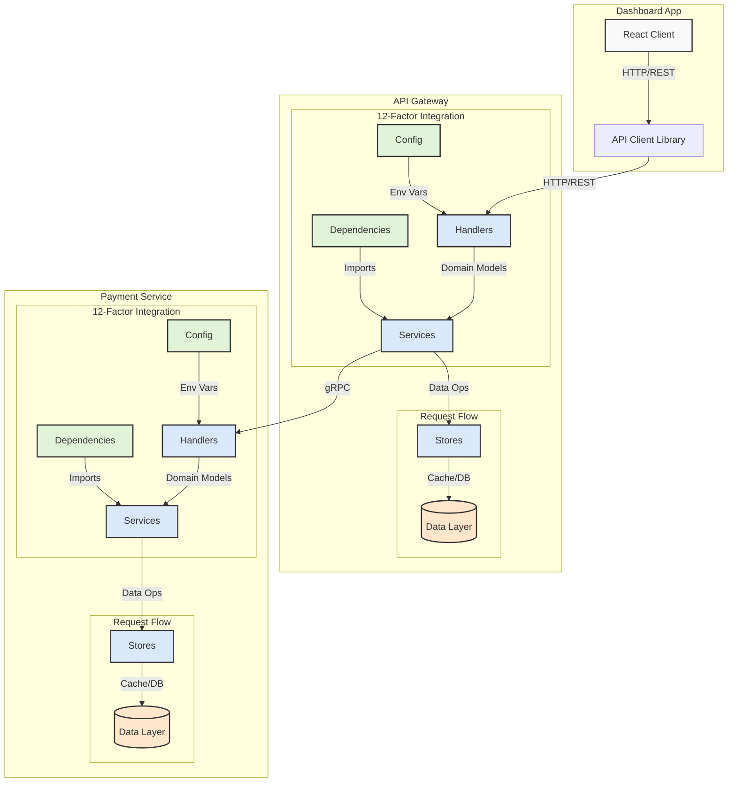
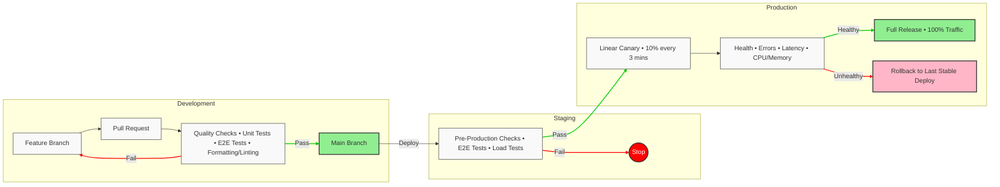

# Autopilot Interview

Welcome to Autopilot's interview project! This repository is a production-grade
environment that mirrors our internal development stack, designed to give you a
real taste of what it's like to work with us.

## Overview

At Autopilot, we believe the best way to evaluate talent is through real-world
scenarios. This repository provides you with a complete development environment
that closely resembles our production stack, allowing you to:

- Experience our modern, full-stack development workflow
- Work with the same tools and technologies we use daily
- Demonstrate your problem-solving skills in a realistic setting

## Tech Stack

This project showcases our cutting-edge technology stack:

### Frontend
- [React 19](https://react.dev/) with [TypeScript](https://www.typescriptlang.org/)
- [React Router v7](https://reactrouter.com/en/main) for client-side routing
- [TailwindCSS v4](https://tailwindcss.com/) for styling
- [Shadcn UI](https://ui.shadcn.com/) for beautiful, accessible components
- [Storybook](https://storybook.js.org/) for component development
- [Vite](https://vitejs.dev/) for blazing-fast builds

### Backend
- [Go 1.23.4](https://go.dev/) for high-performance services
- [PostgreSQL 17](https://www.postgresql.org/) for reliable data storage
- [Redis](https://redis.io/) for caching
- [OpenTelemetry](https://opentelemetry.io/) for observability
- [River](https://github.com/riverqueue/river) for background job processing

## Project Structure

```
├── apps/                       # Frontend applications
│   └── dashboard/              # Main dashboard app
├── backends/                   # Backend services
│   ├── api/                    # API gateway
│   └── payment/                # Payment service
├── packages/                   # Shared packages
│   ├── api/                    # API client library
│   ├── ui/                     # UI component library
│   └── typescript-config/      # Shared TS configs
```

## Getting Started

1. **Prerequisites**
   - [pkgx.sh](https://pkgx.sh) - Universal package manager
   - [Docker](https://www.docker.com/get-started/) - Container platform

2. **Setup**
   ```bash
   # Install pkgx.sh (if not already installed)
   curl -fsS https://pkgx.sh | sh

   # Clone the repository
   git clone git@github.com:autopilot-team/interview.git
   cd interview

   # Setup the development environment
   make setup   # Installs dependencies and configures services
   make reset   # Resets database state

   # Start development servers
   make dev

3. **Development**
   The `make dev` command will start all necessary services. After starting,
   run the command in another terminal to view the local development URLs:
   ```bash
   make domains
   ```

   All services feature hot reload capabilities, automatically rebuilding and
   refreshing when code changes are detected:
   - API contract changes in `packages/api/src/contracts`
   - OpenAPI spec updates from backend API handlers
   - Protocol Buffer changes in backend services

## Architecture

Our system follows a microservices architecture with clean, layered patterns in each service. Here's how requests flow through our system:



Each service implements:

1. **12-Factor Integration**
   - Configuration via environment variables
   - Explicit dependency management
   - Stateless design

2. **Clean Architecture Layers**
   - **Handlers**: Request validation, auth, and routing
   - **Services**: Business logic and workflow orchestration
   - **Stores**: Data persistence and caching

This architecture ensures:
- Clear separation of concerns
- Independent scalability
- Consistent development patterns
- Reliable data flow

## CI/CD Workflow

We follow a robust CI/CD pipeline that ensures code quality and reliable deployments. Our CI pipeline (defined in `.github/workflows/ci.yml`) automatically enforces the following quality gates on every pull request:

- **Formatter/Linter Checks**: Ensures consistent code style and catches common issues
- **Security Checks**: Runs security audits on both frontend and backend dependencies
- **Unit Tests**: Validates core functionality across all services
- **UI Tests**: Ensures visual consistency and catches UI regressions

No code can be merged to the main branch unless all these checks pass, maintaining our high quality standards.



Our deployment pipeline ensures code quality and reliability through:

1. **Development**
   - Feature branches for isolated development
   - Pull requests with automated quality checks
   - Comprehensive testing suite (unit, E2E)
   - Code formatting and linting enforcement

2. **Staging**
   - Pre-production validation
   - End-to-end testing in staging environment
   - Load testing to ensure performance

3. **Production**
   - Linear canary deployments (10% traffic increments)
   - Continuous health monitoring
   - Automated rollback capabilities
   - Full release after successful validation

## What to Expect

During the interview, you'll work on implementing a feature end-to-end, which
might include:

- Frontend component development
- API implementation
- Database schema changes
- Testing and documentation

We're interested in seeing:

- Your problem-solving approach
- Code quality and architecture decisions
- Testing strategies
- Communication skills

## Best Practices

We value:

- Clean, maintainable code
- Comprehensive testing
- Clear documentation
- Thoughtful git commits
- Accessibility considerations

## Need Help?

If you have any questions about the setup or requirements, don't hesitate to
ask. We're here to ensure you can focus on showcasing your skills rather than
fighting with setup issues.
