<table align="center">
    <tbody>
        <tr align="center">
            <td width="25%">
                <br>
                <strong>React 19</strong><br>
                Modern UI Library
            </td>
            <td width="25%">
                <br>
                <strong>TypeScript</strong><br>
                Type-safe Dev
            </td>
            <td width="25%">
                <br>
                <strong>React Router v7</strong><br>
                Single Page Apps
            </td>
            <td width="25%">
                <br>
                <strong>TailwindCSS v4</strong><br>
                Utility-first CSS
            </td>
        </tr>
        <tr align="center">
            <td width="25%">
                <br>
                <strong>Storybook</strong><br>
                Component Dev
            </td>
            <td width="25%">
                <br>
                <strong>Vite</strong><br>
                Frontend Tooling
            </td>
            <td width="25%">
                <br>
                <strong>Go 1.24</strong><br>
                Backend Services
            </td>
            <td width="25%">
                <br>
                <strong>PostgreSQL 17</strong><br>
                Reliable Database
            </td>
        </tr>
        <tr align="center">
            <td width="25%">
                <br>
                <strong>Redis</strong><br>
                In-memory Caching
            </td>
            <td width="25%">
                <br>
                <strong>OpenTelemetry</strong><br>
                Observability
            </td>
            <td width="25%">
                <br>
                <strong>River</strong><br>
                Background Worker
            </td>
            <td width="25%"></td>
        </tr>
    </tbody>
</table>

# Autopilot Interview

Welcome to Autopilot's interview! This repository is a production-grade
environment that mirrors our internal development stack, designed to give you a
real taste of what it's like to work with us.


## ✨ Features

### 🛠️ Production-Grade Environment
- **Microservices Architecture** with API Gateway pattern
- **Comprehensive Monitoring** via OpenTelemetry
- **Background Job Processing** using River
- **Type-Safe API Contracts** across all services

### 🔄 Enterprise-Level CI/CD
- **Automated Quality Gates** for every pull request
- **Comprehensive Testing** including unit and E2E tests
- **Linear Canary Deployments** with automated rollbacks
- **Security-First Approach** with dependency audits

### 👩‍💻 Developer Experience
- **Instant Setup** with one-command development environment
- **Hot Reload** for both frontend and backend changes
- **Component Library** with Storybook integration
- **Clear Documentation** and best practices

## Our Interview Process

At Autopilot, we believe the best way to evaluate talent is through real-world
scenarios. This repository provides you with a complete development environment
that closely resembles our production stack, allowing you to:

- Experience our modern, full-stack development workflow
- Work with the same tools and technologies we use daily
- Demonstrate your problem-solving skills in a realistic setting

### How To Apply

1. Read the repository, familiarize yourself with the project.
2. Ensure that you know how the flow works from frontend to backend.
3. Once you are comfortable/productive working with our tech stack, please
proceed to apply for [Software Engineer](https://confirmed-hardhat-da1.notion.site/Software-Engineer-17e83cad2ee181169d5ae3d6033c7463).
4. We will get back to you within 72 hours to schedule an interview if your
profile matches our requirements.

### What To Expect

During the interview, you'll be using this interview to implement a mini feature end-to-end with
our interviewer within 90 minutes, which might include:

- API implementation
- Database schema changes
- Testing and documentation
- Frontend component development

### Evaluation

- Your problem-solving approach
- Code quality and architecture decisions
- Testing strategies, i.e. mocks/stubs/spies
- Communication skills
- Ability to work with new technologies

## Project Structure

```
├── apps/                      # Frontend applications
│   └── dashboard/             # Main dashboard app
├── backends/                  # Backend services
│   ├── api/                   # API Gateway & Modular Monolith
│   │   ├── internal/          # Internal modules
│   │   │   ├── identity/      # Identity & Authentication module
│   │   │   │   ├── handler/   # HTTP handlers
│   │   │   │   │   └── v1/    # v1 API endpoints
│   │   │   │   │       ├── apikey.go        # API key management
│   │   │   │   │       ├── connection.go    # OAuth connections
│   │   │   │   │       ├── provider.go      # Auth providers
│   │   │   │   │       ├── session.go       # Session management
│   │   │   │   │       ├── twofactor.go     # 2FA implementation
│   │   │   │   │       ├── user.go          # User management
│   │   │   │   │       └── v1.go            # v1 API endpoints
│   │   │   │   ├── model/    # Domain models
│   │   │   │   ├── service/  # Business logic
│   │   │   │   ├── store/    # Data persistence
│   │   │   │   ├── auth.go   # Core auth logic
│   │   │   │   └── module.go # Module config
│   │   │   │
│   │   │   └── payment/      # Payment processing module
│   │   │       ├── ...
│   │   │       └── module.go # Module config
│   │   │
│   │   ├── pkg/              # Public packages
│   │   │   ├── app/          # Application core
│   │   │   │   ├── mocks/    # Mock implementations
│   │   │   │   ├── config.go     # Config management
│   │   │   │   ├── container.go  # DI container
│   │   │   │   └── turnstile.go  # Turnstile security
│   │   │   ├── httpx/        # HTTP utilities
│   │   │   ├── middleware/   # HTTP middleware
│   │   │   └── testutil/     # Testing utilities
│   │   │
│   │   ├── seeders/          # Database seeders
│   │   ├── migrations/       # Database migrations
│   │   ├── templates/        # Email templates
│   │   ├── locales/          # i18n translations
│   │   ├── main.go           # Entry point
│   │   ├── debug.go          # Debug config
│   │   └── release.go        # Release config
│   │
│   └── internal/             # Shared backend packages
│       ├── cmd/              # CLI commands
│       ├── core/             # Core services (DB, HTTP, etc)
│       ├── grpc/             # gRPC utilities
│       ├── http/             # HTTP utilities
│       ├── pb/               # Protocol Buffer definitions
│       ├── pbgen/            # Generated gRPC code
│       └── types/            # Shared types
└── packages/                 # Shared packages
    ├── api/                  # API client library
    ├── ui/                   # UI component library
    └── typescript-config/    # Shared TS configs
```

## Quick Start

## Prerequisites

- Linux:
   - Install Docker and Docker Compose
- MacOS:
   - Install [OrbStack](https://orbstack.dev/download)

## Setup

```sh
# Install `mise`
$ curl https://mise.run | sh

# Add this to your shell profile if `mise` is not in your PATH
$ export PATH="$HOME/.local/bin:$PATH"

# Activate `mise` in your .profile
# Activation options: https://mise.jdx.dev/installing-mise.html#shells
#
# Run ONE of these:
$ echo 'eval "$(mise activate bash)"' >> ~/.bashrc
$ echo 'eval "$(mise activate zsh)"' >> "${ZDOTDIR-$HOME}/.zshrc"
$ echo 'mise activate fish | source' >> ~/.config/fish/config.fish

# Open and validate `mise.toml` before trusting (inside repository root)
$ mise trust

# Install the toolings
$ mise install

# Install projects' dependencies
$ task setup

# Setup docker services (databases, migrations)
$ task reset

# Start Development servers (auto restart)
$ task dev
```

### **Development**

 The `task dev` command will start all necessary services. After starting,
 run the command in another terminal to view the local development URLs:
 ```sh
 $ task domains
 ```

### Testing the Frontend

To verify that everything is working, you can try to access the dashboard. There
isn't much there - but you can use it to verify everything is working right.

- URL: https://localhost:3000/ (Try refreshing to give React a time to start up fully)
- Username: `admin@acme.com`
- Password: `Strongpa$$w0rd!`

 All services feature hot reload capabilities, automatically rebuilding and
 refreshing when code changes are detected:
 - API contract changes in `packages/api/src/contracts`
 - OpenAPI spec updates from backend API handlers

## Architecture

Our system follows a modular monolith architecture with clean, layered patterns
in each module. The modular design allows for clear boundaries between business
domains while maintaining the simplicity and reliability of a monolithic deployment.
Here's how requests flow through our system:


## CI/CD Workflow

We follow a robust CI/CD pipeline that ensures code quality and reliable deployments. Our CI pipeline (defined in `.github/workflows/ci.yml`) automatically enforces the following quality gates on every pull request:

- **Formatter/Linter Checks**: Ensures consistent code style and catches common issues
- **Security Checks**: Runs security audits on both frontend and backend dependencies
- **Unit Tests**: Validates core functionality across all services
- **UI Tests**: Ensures visual consistency and catches UI regressions

No code can be merged to the main branch unless all these checks pass, maintaining our high quality standards.

```mermaid
flowchart LR
subgraph Dev[Development]
direction TB
feat[Feature Branch]
pr[Pull Request]
checks["`Quality Checks • Unit Tests • E2E Tests • Formatting/Linting`"]
trunk[Main Branch]
end
subgraph Stage[Staging]
validate["`Pre-Production Checks • E2E Tests • Load Tests`"]
stop((Stop))
end
subgraph Prod[Production]
direction TB
canary["`Linear Canary • 10% every 3 mins`"]
metrics["`Health • Errors • Latency • CPU/Memory`"]
full["`Full Release • 100% Traffic`"]
prev["`Rollback to Last Stable Deploy`"]
end
feat --> pr
pr --> checks
checks -->|Pass| trunk
checks -->|Fail| feat
trunk -->|Deploy| validate
validate -->|Pass| canary
validate -->|Fail| stop
canary --> metrics
metrics -->|Healthy| full
metrics -->|Unhealthy| prev
classDef default fill:#f9f9f9,stroke:#333,stroke-width:1px
classDef success fill:#90EE90,stroke:#333,stroke-width:2px
classDef failure fill:#FFB6C6,stroke:#333,stroke-width:2px
classDef stop fill:#FF0000,color:#fff,stroke:#333,stroke-width:2px
classDef prev fill:#FFB6C6,stroke:#333,stroke-width:2px
class trunk,full success
class prev failure
class stop stop
linkStyle 0,1,4,7 stroke:#333,stroke-width:1px
linkStyle 2,5,8 stroke:#00CC00,stroke-width:2px
linkStyle 3,6,9 stroke:#FF0000,stroke-width:2px
```



Our deployment pipeline ensures code quality and reliability through:

1. **Development**
   - Feature branches for isolated development
   - Pull requests with automated quality checks
   - Comprehensive testing suite (unit, E2E)
   - Code formatting and linting enforcement

2. **Staging**
   - Pre-production validation
   - End-to-end testing in staging environment
   - Load testing to ensure performance

3. **Production**
   - Linear canary deployments (10% traffic increments)
   - Continuous health monitoring
   - Automated rollback capabilities
   - Full release after successful validation

## Need Help?

If you have any questions about the setup or requirements, don't hesitate to
ask. We're here to ensure you can focus on showcasing your skills rather than
fighting with setup issues.
